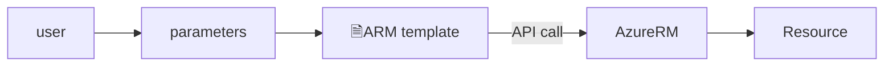

# Lab - ARM templates: podstawy

## Wymagania
Aktywna subskrypcja w Azure i dostęp do portalu.

## Wstęp
### Cel
Zrozumienie struktury plików oraz podstawy wdrożeń. 

Czas trwania: 30 minut

### Struktura
ARM templates są zapisane w formacie JSON i posiadają definicję zasobów (nazwa, lokalizacja, dodatkowe cechy, jak np. wielkość dysku twardego), które mają być stworzone w chmurze.
W uproszczeniu stanowią treść zapytania do API chmury Azure, czyli AzureRM.



Pojedynczy template może być wykorzystywany wielokrotnie i dzielony między zespołami lub projektami, m.in. dzięki parametryzacji. Dojrzałe szablony są dostarczane z bazowym plikiem z definicją zasobów oraz plikiem z parametrami. Parametry można również podać in-line w ramach wywołania za pomocą polecenia konsoli.

Samo wdrożenie szablonu może być wykonane m. in. przez:
- portal <link>
- PowerShell/az cli
    ```powershell
    ## Wywołanie z wykorzystaniem pliku
    New-AzGroupDeployment -

    ## Przekazanie parametrów in-line
    ```

    ```shell
    ## Wywołanie z wykorzystaniem pliku
    az group deployment
    ```
- zapytanie do API (np. curl)


### Polecenia konsoli
Polecenie `terraform` pozwala na uruchomienie Terraforma w wierszu poleceń. W praktyce jest to całe środowisko pozwalające na sprawdzanie, tworzenie i zarządzanie zasobami (terraformowymi, nie cloudowymi).

Przydatne polecenia na początek:
```bash

```

### Krok 0 - Uruchom Cloud Shell w Azure i sklonuj kod ćwiczeń Nawiguj w przeglądarce do [portal.azure.com](https://portal.azure.com), uruchom "Cloud Shell" i wybierz `Bash`.  Oficjalna dokumentacja: [Cloud Shell Quickstart](https://github.com/MicrosoftDocs/azure-docs/blob/main/articles/cloud-shell/quickstart.md).
```bash
git clone https://github.com/wguzik/
```

> Poniższe kroki realizuje się za pomocą Cloud Shell.


### Krok 8 - Usuń zasoby

```
terraform destroy
```

## Zadanie domowe
Dodaj więcej do zmiennej `environment` ograniczenie dotyczące możliwych wartości, np 'dev', 'test', 'prod'.